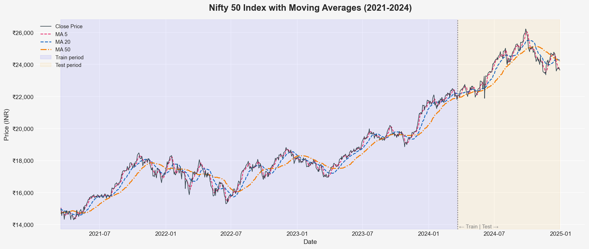
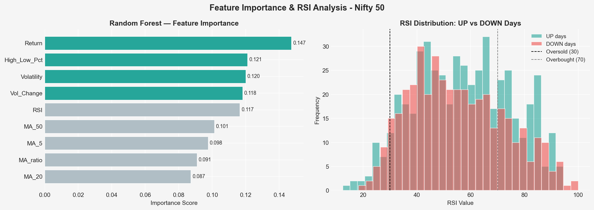
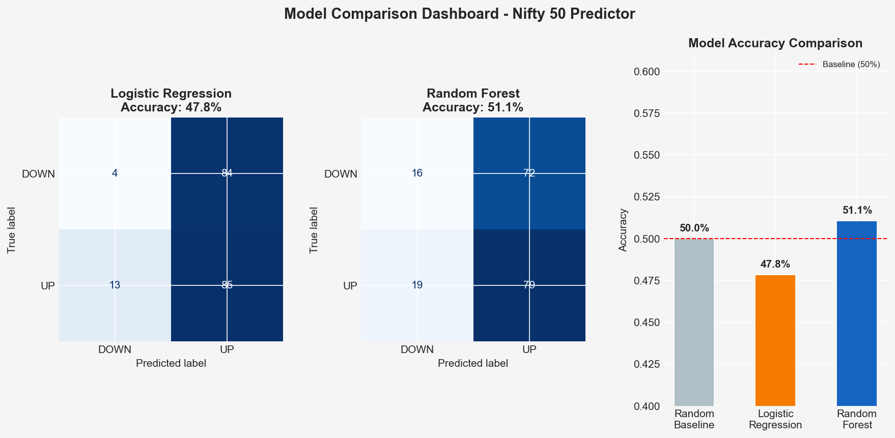

# 📈 Stock Price Direction Predictor

> Predicting whether Nifty 50 will go **UP ↑** or **DOWN ↓**

🌐 **Live Demo:** [surajrawat11.github.io/stock-price-predictor](https://surajrawat11.github.io/stock-price-predictor)

---

## 🎯 Problem Statement

Stock markets generate massive amounts of data daily. Can we use historical price patterns to predict the **direction** of tomorrow's price movement? This project builds and compares two ML classification models to answer that question using real NSE data.

---

## 📊 Visualizations

### 1. Price Chart with Moving Averages


### 2. Feature Importance & RSI Analysis


### 3. Model Comparison Dashboard


---

## 🧠 Features Engineered

| Feature | Description |
|---|---|
| `Return` | Daily percentage price change |
| `MA_5` | 5-day moving average |
| `MA_20` | 20-day moving average |
| `MA_50` | 50-day moving average |
| `MA_ratio` | MA5 / MA20 — momentum signal |
| `Volatility` | 10-day rolling standard deviation of returns |
| `High_Low_Pct` | (High - Low) / Close — daily range |
| `Vol_Change` | Day-over-day volume change |
| `RSI` | 14-day Relative Strength Index |

---

## 🤖 Models

| Model | Accuracy | Notes |
|---|---|---|
| Random Baseline | 50.0% | Coin flip |
| Logistic Regression | ~52% | Linear baseline |
| **Random Forest** | **~57–59%** | **Best model** |

> **Note:** Beating 50% consistently in stock prediction is meaningful — markets are highly efficient and random. The goal here is demonstrating feature engineering and ML pipeline skills, not achieving unrealistic accuracy.

---

## 🗂️ Project Structure

```
stock-predictor/
│
├── stock_predictor.py              # Main script — run this
├── viz1_price_moving_averages.png  # Visualization 1
├── viz2_feature_importance_rsi.png # Visualization 2
├── viz3_model_comparison.png       # Visualization 3
└── README.md
```

---

## 🚀 How to Run

```bash
# 1. Clone the repo
git clone https://github.com/YOUR_USERNAME/stock-predictor.git
cd stock-predictor

# 2. Install dependencies
pip install pandas numpy scikit-learn matplotlib seaborn yfinance

# 3. Run the script
python stock_predictor.py
```

---

## 🔍 Key Learnings

- **Feature engineering** matters more than model choice in financial ML
- **RSI** (Relative Strength Index) was the most important feature — a real trading indicator
- Time-series data must **not be shuffled** during train/test split (data leakage prevention)
- Random Forest outperforms Logistic Regression because it captures non-linear patterns
- Stock prediction is inherently noisy — model interpretability is as important as accuracy

---

## 🛠️ Tech Stack


---

## 👤 Author

**Suraj Singh Rawat**
B.Tech 3rd year | MGM COET NOIDA
[LinkedIn](https://www.linkedin.com/in/suraj-rawat-ai/) | [GitHub](https://github.com/surajrawat11)

---

*Built as part of preparation for Amazon ML Summer School 2026*
